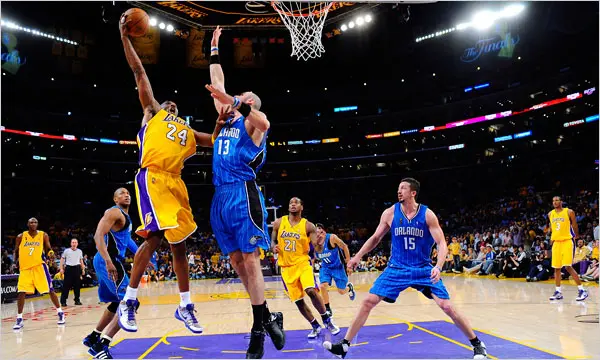

Basketball players who make several baskets in succession are described as having a *hot hand*. Fans and players have long believed in the hot hand phenomenon, which refutes the assumption that each shot is independent of the next. However, a 1985 paper by Gilovich, Vallone, and Tversky collected evidence that contradicted this belief and showed that successive shots are independent events ([http://psych.cornell.edu/sites/default/files/Gilo.Vallone.Tversky.pdf](http://psych.cornell.edu/sites/default/files/Gilo.Vallone.Tversky.pdf)). This paper started a great controversy that continues to this day, as you can see by Googling *hot hand basketball*.

Our investigation will focus on Kobe Bryant's performance with the Los Angeles Lakers in the 2009 NBA finals when playing against the Orlando Magic, which earned him the title *Most Valuable Player*.  Many spectators commented on him having a *hot hand*. Let's load some data from those games and look at the data structure with `str`.

<div style="small">
```{r loadkobe-data, eval=TRUE, results='markup', echo=FALSE}
load("kobe.RData")
```
</div>

### Question 1

What was his typical streak length? How long was his longest streak of baskets?

```{r make-fn-get_streak, eval=T, echo=FALSE}
get_streak <- function(shots){
  current_streak_length <- 0
  stored_streak_length <- NULL  # vector of streaks 
  for(x in 1:length(shots)){  # cycle x through length of shots
    if(shots[x] == "H"){
      current_streak_length = current_streak_length + 1 # adds 1 for each H in a streak
      if(x == length(shots)){ #if x is the last one in the game that also an streak end
        stored_streak_length <- c(stored_streak_length,current_streak_length) 
      } 
      next # jumps to next value for x
    }else{
      stored_streak_length <- c(stored_streak_length,current_streak_length) #updating latest streak to vector 
      current_streak_length = 0
    }
  } 
  stored_streak_length # returns vector 
} 
kobe_basket_streak <- get_streak(shots = kobe$basket)
summary(kobe_basket_streak)
kobe_streak_table <- table(kobe_basket_streak)
names(dimnames(kobe_streak_table)) <- c("Kobe's Streaks Percentage")
prop.table(kobe_streak_table)
barplot(table(kobe_basket_streak), 
        main = "Kobe's Shooting Streaks", 
        col = c("Orange"), 
        xlab = "Streak Length",
        ylab = "Amount",
        ylim = c(0,40))
```

**Kobe's typical streak length is 0, and his longest streak is 4 baskets.**

We can also observe that his shooting average for this game was about 49%. 